#一、实验步骤：

##（1）确定传输模式

通过 socket 方式实现一个基于 Client/Server并希望实现多线程并发传输

##（2）设计Client/Server模式的文件传输程序实现并发传输

分别实现客户端与服务器端：

###服务器端

​	监听客户端请求，当有新的客户端进行发送文件请求时开启一个新的线程实现连接传输，并用面向连接的方式实现通信，采用java底层提供的
Socket
​	类对象，接收客户端发送的文件并保存在特定的位置，本地生成一个实时记录已发送文件信息的log日志，用于断点续传的确认

###客户端

​	读取待发送文件，并用一定大小的字节流数组进行分割，向服务器端发送请求，若服务器端解析log日志后反馈存在断点则继续发送未完成部分。同样并用面向连接的方式实现通信，采用java底层提供的Socket 类对象

##（3）调试项目并记录过程用于书写报告

#二、实验数据：

##（1）单用户发送文件测试

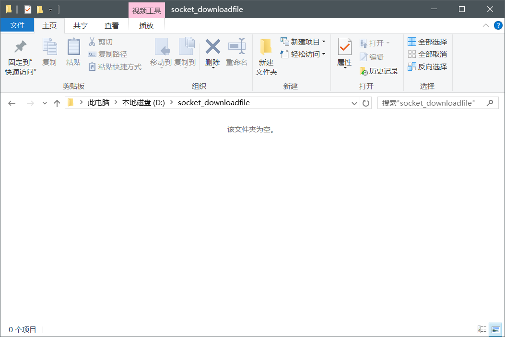

服务器接收传输文件目录原本为空

客户端目录有两个用于传输测试的文件

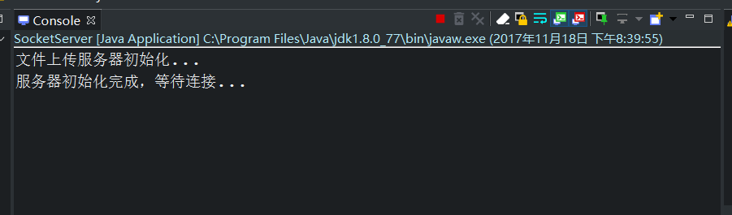

开启对本地指定端口的侦听后等待客户端请求连接

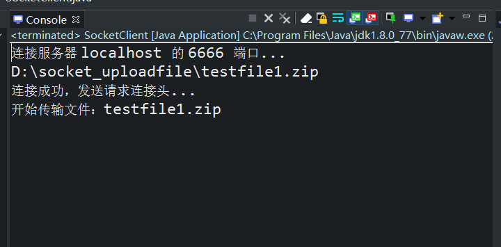

客户端请求成功同时文件传输开始

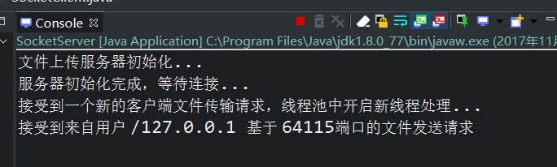

服务器端开始接收新的连接请求

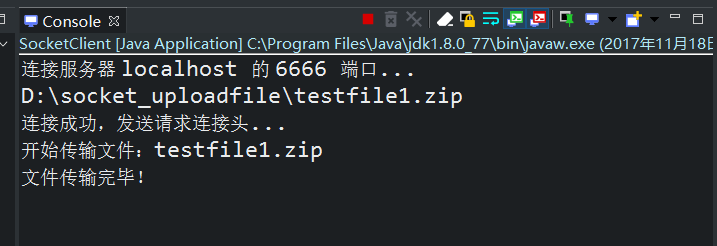

一定时间后完成传输

##（2）服务器处理多用户同时并发发送文件测试

基于上述过程后直接新建一个发送testfile2.zip的客户端程序进行测试

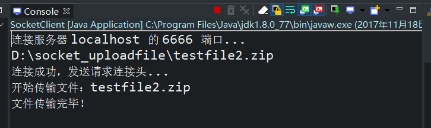

新开启客户端发送“testfile2.zip”文件

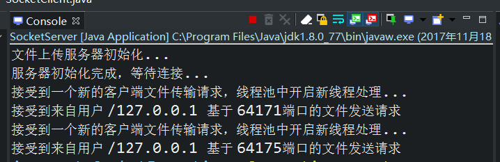

利用新线程和对应的新端口进行新的任务处理

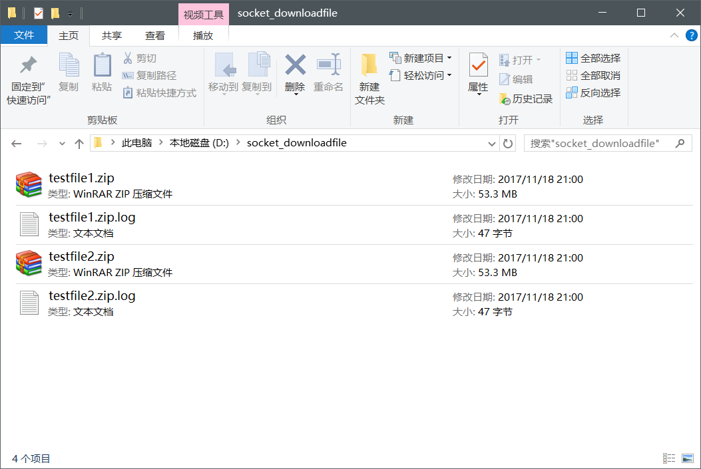

并发执行后产生了服务器端成功接收两个文件

##（3）断点续传测试

换用大文件传输方便控制发送中断

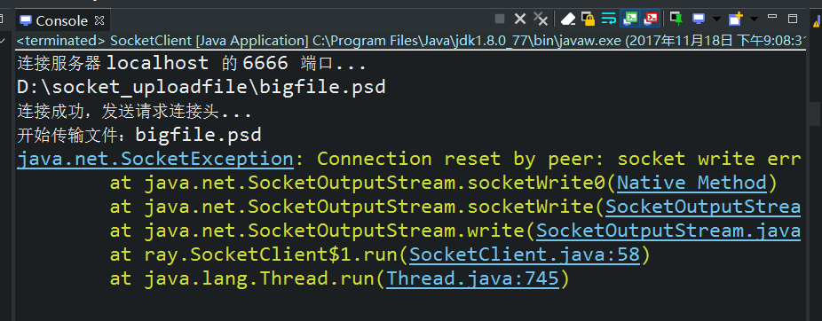

在客户端中间停止传输并发生连接报错

服务器端接收的文件因不完整而不可用

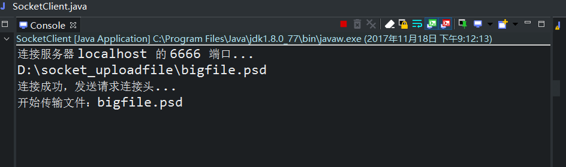

直接重新开启文件传输

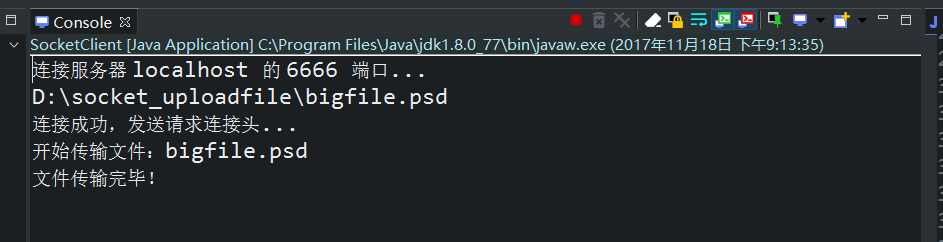

缩短了完成发送的时间

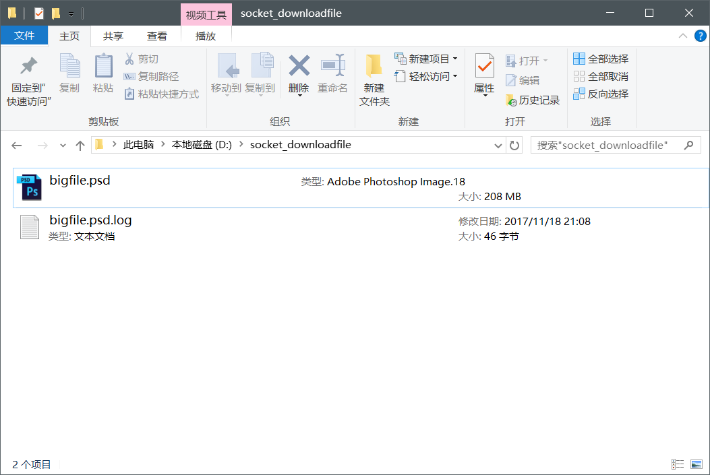

此时已经完成完整的传输

文件为完整可用的PSD文件

#三、实验主要过程：

##（1）服务器端主要实现过程

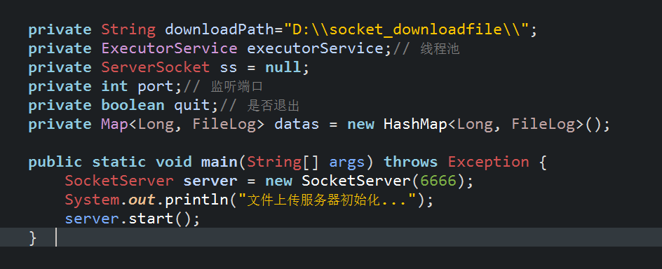

服务器侦听开启的关键代码截图

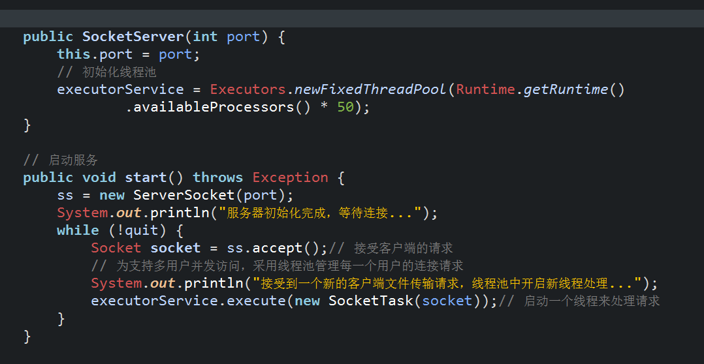

单个线程与线程池增加线程的逻辑截图

断点判断和加载的关键逻辑

##（2）客户端主要实现过程

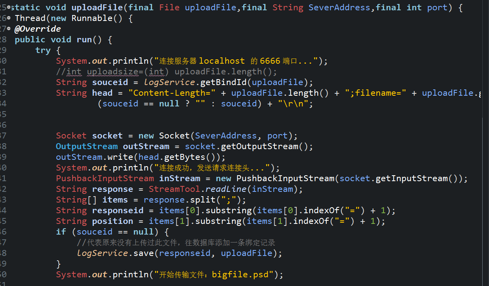

请求头的处理主要逻辑截图

客户端数据发送日志关键逻辑

##（3）公用字节流工具类

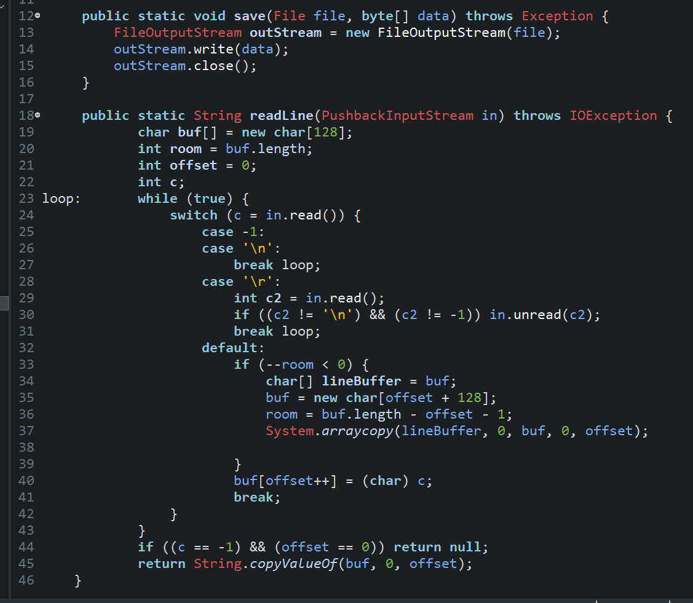

字节流处理关键代码截图
